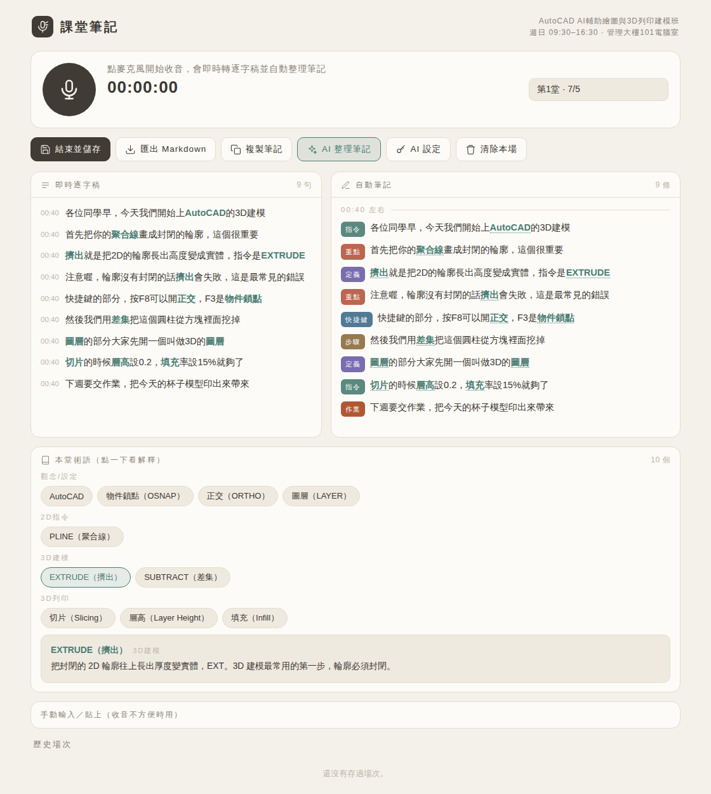

# 課堂筆記

> 帶去上課的收音筆記器：麥克風收老師講課 → 即時逐字稿 → 自動整理成結構化筆記。
> 內建「AutoCAD AI輔助繪圖與3D列印建模班」的領域知識庫，聽錯的專有名詞會自動校正，筆記才不會寫錯。
> 純前端 PWA，逐字稿與筆記只存在你自己的裝置裡。



## 它跟一般錄音／聽打 App 不一樣的地方

一般語音轉文字不懂課堂內容，會把「圖層」打成「土層」、「G-code」打成「G扣」，照抄只會做出錯的筆記。這個 App 內建這門課的知識庫（90+ 條 AutoCAD 指令、3D 列印參數、AI 輔助功能術語）：

1. **聽錯自動校正**：「奧圖凱德」→ AutoCAD、「光古化」→ 光固化、「據合線」→ 聚合線…
2. **自動抓重點**：聽到「指令、定義、步驟、注意事項、快捷鍵、作業」句型，自動分類成條列筆記，不用自己邊聽邊抄
3. **術語即時解釋**：課堂提到的術語會列在下方，點一下就有白話解釋（上課聽不懂馬上查）
4. **AI 總整理（選配）**：下課按一鍵，把整堂課逐字稿交給 Claude 用課程領域知識校對、分節整理成完整複習筆記（需要自己的 Anthropic API Key）

## 上課怎麼用

1. 用**電腦版 Chrome 或 Edge** 開啟 App 網址（教室電腦或自己筆電都行）
2. 點大麥克風，允許使用麥克風，就開始收音了 — 逐字稿與筆記即時長出來
3. 下課點「結束並儲存」，之後可「匯出 Markdown」或「複製筆記」
4. 場次會自動以課程週次命名（第1堂 7/5 … 第8堂 8/30，已排除 7/26、8/9 停課日）

> **手機**：iPhone Safari 對網頁語音辨識支援有限，可加入主畫面當 App 用，收音改用「手動輸入」框＋鍵盤左下角麥克風聽寫，術語校正與自動筆記照常有效。

## AI 整理筆記（選配）

- 點「AI 設定」貼上自己的 Anthropic API Key（[platform.claude.com](https://platform.claude.com/) 申請）
- Key 只存在瀏覽器 localStorage，逐字稿由你的瀏覽器直接傳給 Anthropic API，不經過任何中介伺服器
- 沒有 Key 也完全可用 — 規則式自動筆記、術語校正都是離線內建的

## 網址

跟「唸記帳」共用 GitHub Pages 部署：

- `https://hsukim-cpu.github.io/deskmemo/classnote/`

## 本機預覽（開發者）

```bash
cd classnote
python3 -m http.server 8000
# 瀏覽器開 http://localhost:8000（語音辨識需要 Chrome/Edge；localhost 視為安全來源可用麥克風）
```

## 資料與隱私

- 場次存在瀏覽器 `localStorage`（key：`classnote.sessions.v1`），只留在這台裝置
- 錄音**不會存下音檔**，只留文字逐字稿（Web Speech API 的語音辨識由瀏覽器提供，Chrome 會把音訊送到 Google 的辨識服務）
- 清除瀏覽器網站資料會一併清掉筆記，重要筆記記得匯出 Markdown
