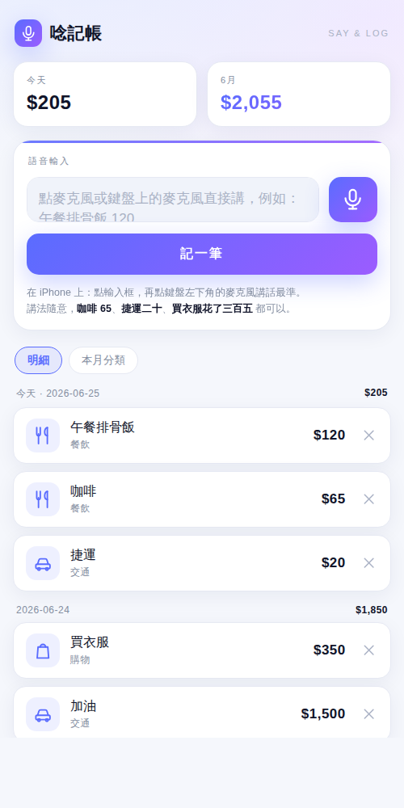

# 唸記帳

> 說一句話就自動記一筆帳的 iPhone 語音記帳器。
> 純前端 PWA，離線可用、資料只存在你手機裡，不用註冊、不用網路、不上傳任何資料。



## 它跟一般記帳 App 不一樣的地方

直接「用講的」：點麥克風（或 iPhone 鍵盤左下角的麥克風）說出花費，App 自動從你的話裡抓出**金額、分類、項目**，按一下就記好。

- 「午餐排骨飯 120」→ 餐飲 · 午餐排骨飯 · $120
- 「捷運二十」→ 交通 · 捷運 · $20
- 「買衣服花了三百五」→ 購物 · 買衣服 · $350（聽得懂台式口語：三百五＝350）
- 「房租八千五」→ 居家 · 房租 · $8,500

抓完會先跳出一張確認卡，金額、分類、項目、日期都能手動改，確認沒問題再加入，不怕記錯。

## 在 iPhone 上怎麼裝（不用上架 App Store）

這是一個網頁 App（PWA）。把網址打開後「加到主畫面」，圖示就會出現在桌面，點開跟一般 App 一樣全螢幕，且**離線也能用**。

1. 用 **Safari** 打開這個 App 的網址（見下方「怎麼上線」）
2. 點下方中間的「分享」鈕 → 往下找「**加入主畫面**」→ 加入
3. 回到主畫面點「唸記帳」圖示開啟
4. 點輸入框，再點 iPhone 鍵盤左下角的**麥克風**講話，講完按「記一筆」

> 為什麼用鍵盤的麥克風而不是 App 內建錄音？因為 iPhone Safari 對網頁語音辨識支援有限，
> 改用系統內建的「鍵盤聽寫」最穩、辨識也最準。支援的瀏覽器（如電腦版 Chrome）則可直接點 App 裡的麥克風鈕錄。

## 怎麼上線（讓 iPhone 連得到）

PWA 需要透過 HTTPS 提供，本專案用 **GitHub Pages** 自動部署：

- 已設定 `/.github/workflows/deploy-pages.yml`，推送到 `main` 會自動部署
- 網址：`https://hsukim-cpu.github.io/deskmemo/expense/`

首次啟用需在 repo 的 Settings → Pages 把 Source 設為 `GitHub Actions`（一次性）。

## 本機預覽（開發者）

純靜態檔案，任何靜態伺服器都能跑（Service Worker 需要 http(s)，不能直接用 file://）：

```bash
cd expense
python3 -m http.server 8000
# 瀏覽器開 http://localhost:8000
```

## 資料與隱私

- 所有紀錄存在瀏覽器的 `localStorage`（key：`saymoney.entries.v1`），**只留在這台裝置**
- 沒有後端、沒有帳號、不連任何伺服器
- 注意：清除 Safari 網站資料會一併清掉記帳資料；換手機不會自動同步

## 設計

- 亮色、簡約、未來感的介面，全部使用線條 SVG 圖示，不用 emoji
- indigo → violet 漸層作為主色

## 功能

- 語音／文字輸入，規則式自動解析金額・分類・項目（離線、免 API）
- 加入前可手動修正金額、分類、項目、日期
- 明細按日期分組，顯示每日小計、今天合計、本月合計
- 「本月分類」長條圖看錢花在哪
- 單筆刪除
- 離線可用、可加到主畫面像原生 App

## 分類關鍵字

內建 6 大類＋其他：餐飲、交通、購物、娛樂、居家、醫療。
講話命中關鍵字就自動歸類，沒命中就放「其他」，也可在確認卡手動選。
要加自己的關鍵字，改 `index.html` 裡的 `CATS` 陣列即可。
